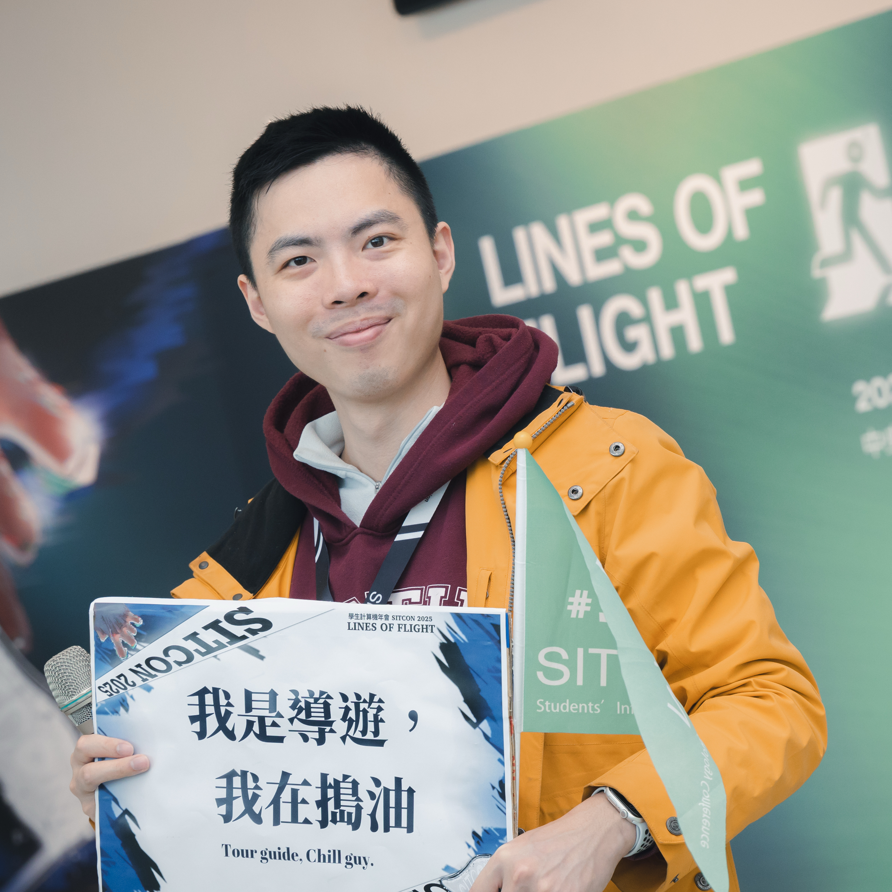

# Atlas You｜游毓堂

Name: 游毓堂  
Email: [vandcfuture@gmail.com](mailto:vandcfuture@gmail.com)  
GitHub: [atlasforcn](https://github.com/atlasforcn)  
Website: [atlas-home](https://atlasforcn.github.io/atlas-home/)

航太計畫專案管理、衛星通訊、資安社群、數位韌性培訓與國際協作。

## 個人摘要

具備太空任務、衛星通訊、資訊安全社群與跨域專案管理經驗。
曾於國家太空中心參與立方衛星計畫，負責任務週期、時程管理、技術意見、系統整合與跨單位協作。

創辦星希科技，推動衛星技術、教育服務與太空產業相關專案。
另參與 HITCON CMT、SITCON、新竹市青年諮詢、國際交流與數位韌性培訓。

## 授課、演講與主持

- 2025｜史瓦帝尼數位韌性與資安英文訓練｜英文授課／專題演講｜五天工作坊，共六堂課。
- 2025｜TEDx｜英語講者｜以「我想成為一個太空人」為主題進行英文分享。
- 2025｜HITCON｜Lightning Talk 主持人｜擔任閃電秀主持人。
- 2024｜HITCON CMT｜總召集人｜開閉幕主持、閃電講主持。
- 2024｜ISPAC｜研討會顧問｜協助學生火箭推進與標準化相關分享。
- 2020-2021｜NASA 黑客松｜指導老師｜指導高中生團隊規劃太空生存模擬作品。
- 2020｜太空科技應用｜受邀分享｜分享太空專案經驗與太空科技應用。
- 2024｜新竹市 ESG 綠領人才培育論壇｜主持人｜聚焦綠領人才、GEP、ESG 與永續城市。
- 2022｜SITCON 學生計算機年會｜主持人｜協助主持活動場次。
- 2023-2024｜梅竹賽射箭競賽｜主持人｜主持 2023、2024 梅竹賽射箭競賽。
- 2023-2025｜HITCON｜海外講者旅遊陪同翻譯｜協助海外講者在台行程與溝通。
- 2017｜Kingdoms and Castles｜繁中翻譯與校對｜參與城市建造遊戲中文化。

## 得獎與榮譽

### 開發、太空與跨域競賽

- 2025｜新竹政策黑客松｜第三名｜市民事件回報系統，結合地圖與 AI 問答輔助民眾描述問題。
- 2023｜ETHTaipei｜Gnosis 金牌、PSE 特別獎｜StatVoting，零知識證明區塊鏈投票機制。
- 2023｜NASA 黑客松｜女力獎｜太空殖民地建設管理策略遊戲。
- 2022｜大專優秀青年｜獲選｜因公共服務與社會參與獲選。
- 2022｜對話機器人設計大賽｜第三名｜LLM 為底的人工智慧陪伴系統。
- 2022｜NASA 黑客松｜聯發科特別獎｜Variable star 模擬與觀測。
- 2021｜iCASE 立方衛星設計競賽｜冠軍｜立方衛星重力場探勘任務設計。
- 2020｜NASA 黑客松｜女力獎｜火星通訊與環境探索遊戲。
- 2019｜MIT 國際基因工程設計競賽｜金牌獎｜E.Phoenix 自毀細胞輻射探測機制。
- 2019｜AIOT 物聯網競賽｜第二名、傑出簡報獎｜智慧停車路樁 RFID 物聯網平台。
- 2019｜中華電信梅竹黑客松｜第三名｜居家照護穿戴裝置資訊平台。
- 2019｜NASA 黑客松｜羽澤光電特別獎｜韋伯望遠鏡管理遊戲。
- 2019｜交大種子基金創業競賽｜複賽獎金十萬元｜區塊鏈數位教育資訊共享平台。
- 2019｜物聯網黑客松創業競賽｜決賽｜智慧輪椅無障礙使用者交友場域。

### 射箭校隊競賽紀錄

- 個人新人組｜第二名。
- 30 公尺個人項目｜第四名。
- 30 公尺團體賽｜冠軍。
- 射箭校隊經歷｜因肩膀受傷退役。

## 工作經驗

- 2022.12-2026.06｜國家太空中心｜立方衛星計畫室技術專案管理｜負責任務時程、週期、技術討論與跨單位協調。
- 2020.08-｜星希科技有限公司｜創辦人｜持續營運太空教育、衛星技術、無線電、物聯網與資安教育服務。
- 2020-2021｜星達資本｜教育產業研究員實習｜進行教育產業評估、業者訪談、市場分析與專案報告。
- 2020｜國家太空中心｜專案實習生｜設計並管理 6U 立方衛星嵌入式系統專案，負責專案管理與成果報告。
- 2018.03-2018.07｜Azuro Republic｜時尚首飾品牌實習｜協助數位流量、Pinterest 內容與 OEM / ODM 商務開發。

## 社群與公共參與

- 2025｜PyCon｜攝影組組員｜協助活動影像紀錄與攝影工作。
- 2024-2025｜HITCON Community 台灣駭客年會｜總召集人／Lightning Talk 主持人｜2024 總召；2025 閃電秀主持人。
- 2024｜ISPAC｜研討會顧問｜協助學生火箭推進、標準化與相關研究分享。
- 2022-2025｜新竹市政府青年事務委員會｜第二、三屆委員｜參與市政建議，關注永續、科技政策與青年公共參與。
- 2021-2022｜國立陽明交通大學學生會交通分會｜會長｜統籌新生手冊、社團博覽會、校慶演唱會與梅竹電競。
- 2021｜第九屆 SITCON 學生計算機年會｜總召集人｜負責活動決策；受疫情影響轉線上，累積逾兩萬四千人次觀看。
- 2019-2020｜國立交通大學學生議會｜學生議員｜擔任校內委員會代表，接受學生陳情並向校方反映問題。
- 2016｜SUNY Stony Brook｜國際學生大使與華人學生活動召集人｜協助國際學生適應校園，建立華人新生通訊網。
- 2015-2016｜Bellevue College｜國際學生大使與亞太學生會財務部長｜擔任活動志工、中文通譯與財務出納。

## 教育背景

- 2018-2022｜國立陽明交通大學｜百川學士學位學程｜修習傳播、資工、電機、太空工程、生物與企管。
- 2016｜SUNY Stony Brook｜生物科技｜由 Bellevue College 轉學，後返國。
- 2014-2016｜Bellevue College｜Art and Science Track 副學士｜修習生物、化學、商業、經濟、微積分與程式設計。

## 著作與研究成果

- 2022｜AIED｜AI Service to Assist Self-regulated Learning｜第三作者；LNCS pp. 577-581，DOI: 10.1007/978-3-031-11647-6_119。

## 專案與研究方向

- 學生火箭標準化平台｜低空、亞音速學生火箭模組化平台｜關注酬載、控制、結構、回收介面與標準零件庫。
- 太空通訊與跨層協調｜太空與通訊系統研究｜關注 RF / optical link、地對太空通訊、資料可靠性與多層網路協同。
- UMAL: Universal Mission Abstraction Layer｜地球觀測任務抽象層｜串接事件需求、任務排程、協調與資料回收。
- 6U 立方衛星嵌入式系統模式設計｜6U 衛星狀態機與操作模式｜包含功能管理、需求釐清與專案管理。
- 太空系統工程與產業本土化｜台灣太空產業商業化與垂直整合研究｜關注任務流程、產學協作與產業鏈連結。
- 史瓦帝尼數位韌性與資安英文訓練｜數位韌性與資安英文培訓｜五天工作坊，共六堂課，涵蓋資安、通訊安全與反詐騙。
- G-9-2: 數位韌性 x 青年行動｜教育部青年百億海外圓夢基金｜已完成法國觀察，並繳交資安治理報告。
- 跨域專題｜物聯網智慧溫室、地震災害即時通報、地方文化宣傳｜另含金融機器學習、生技與物聯網專案分析。

## 國際交流、培訓與證明

- 2025｜日本 JAXA 種子島宇宙中心｜參訪｜深化太空任務、發射場域與地球觀測理解。
- 2025｜新加坡青年交流／TEDx 英語分享｜代表／英語分享｜代表新竹市參與國際青年交流與英文技術分享。
- 2025｜NASA Fundamentals of Remote Sensing｜證書｜完成課程，補強科學資料應用與地球觀測理解。
- 2019｜新竹科學園區產訓協會｜物聯網培訓證明｜Python 與 App Inventor 相關培訓。
- 2016｜TOEIC 多益金色證書｜英文能力證明｜年代已久，現已失效。

## 語言能力

- 英文：精通，可進行日常生活及特定領域的即時翻譯。
- 法文：A2 學習中。
- 日文：具旅遊日文溝通能力，簡單內容大致能聽懂。

## 核心能力

- 專案管理｜任務規劃、時程追蹤、風險管理、跨單位協作、活動籌備。
- 太空與通訊｜CubeSat、6U 立方衛星、衛星任務、通訊架構、生命週期規劃。
- 系統整合｜需求釐清、酬載整合、測試規劃、系統審查、流程標準化。
- 資安與社群｜資安教育、HITCON CMT、SITCON、數位韌性培訓。
- 國際溝通｜英文授課、青年交流、跨文化協作、國際技術溝通。
- 產業分析｜教育產業研究、太空產業需求分析、商務開發。
